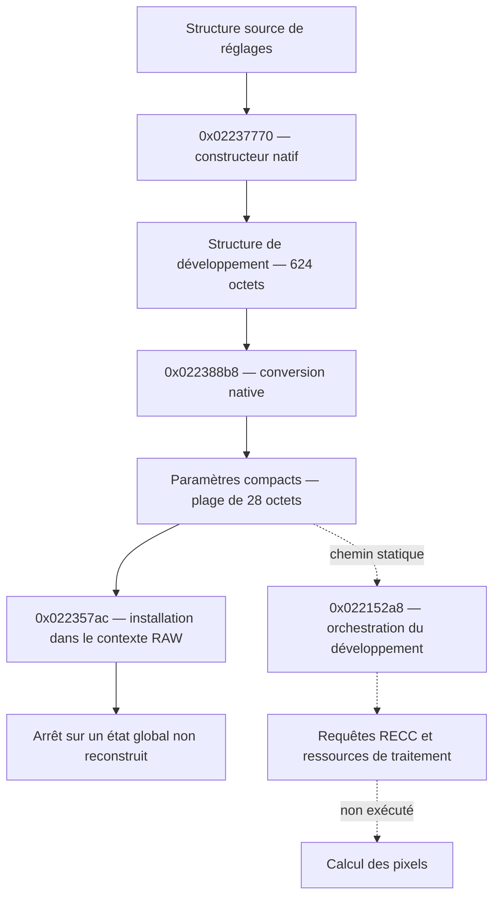

# Circulation native des réglages et dépendances ThreadX

Recherche locale du 11 septembre 2026, à la suite de [l’extraction X-T4](NATIVE_XT4.md). **Aucun calcul de pixels Fuji n’est encore exécuté.** Les nouvelles preuves concernent la circulation des paramètres et des fonctions système ciblées.

**Mise à jour :** le banc avec calendrier termine maintenant les trois étapes dans 272 cas. La synchronisation et l’initialisation des requêtes permettent d’atteindre le lecteur RAW, validé séparément sur les métadonnées d’un RAF réel. [Suite détaillée](NATIVE_RUNTIME.md). Les arrêts décrits ci-dessous restent ceux du probe historique sans cet état supplémentaire.

## Chemin retrouvé



Les appels au convertisseur se trouvent à `0x021ed2d4` et `0x021ed400`. La branche étudiée passe ensuite par `0x022152a8`, qui appelle l’installateur à `0x02215348`. Une autre branche appelle `0x02214384` ; elle n’est pas déclarée équivalente sans analyse supplémentaire.

L’orchestration appelle `0x022053c0` avec les codes `0x32` et `0x33`. Le fichier public versionné `reccf_act_code.h` les nomme requête et réponse de traitement RECC. C’est un indice pour suivre les opérations, sans preuve que cette fonction effectue elle-même le calcul couleur. [Définitions fffw](https://github.com/tiredboffin/fffw/blob/bedc091e0b54a1a34aaf6929dd08e1db36d13b08/ffun/ports/xt4/0212/reccf_act_code.h).

## 272 essais de circulation des paramètres

Le banc rejoue les 136 cas admissibles du constructeur, puis exécute le convertisseur avec chacun des deux modes R1 = 0 et R1 = 1. Les sorties réellement produites deviennent les entrées de la fonction suivante. Aucun remplacement d’appel n’intervient.

| Champ suivi | Offset source / contexte RAW | Offset compact |
|---|---:|---:|
| Identifiant interne de film | `0x5c4` | `0x05` |
| Code de dynamique | `0xb14` | `0x04` |
| Hautes lumières | `0x611` | `0x17` |
| Ombres | `0x612` | `0x18` |
| Décalage WB, axe 0 | `0x5c0` | `0x12` |
| Décalage WB, axe 1 | `0x5c1` | `0x13` |

Les six champs retrouvent leurs valeurs initiales pour les 272 essais. Le convertisseur retourne après 208 à 238 instructions. L’installateur exécute 148 instructions puis s’arrête sur une lecture à `0x01b8441c`, depuis `0x0126a114`. Cette faute est une limite attendue du banc, **pas un retour réussi de l’installateur**.

Le résultat `passed` signifie : champs conservés, retour du convertisseur, gardes respectées et dépendance manquante précisément retrouvée. Le rapport conserve `installer_completed: false`, `image_pipeline_executed: false` et `camera_oracle_used: false`.

Le contexte RAW et l’en-tête auxiliaire sont synthétiques. Ce ne sont pas des captures RAM ni un RAF valide. Les offsets n’établissent pas une correspondance complète avec les menus ou les réglages publics d’une recette.

Dans la plage compacte de 28 octets, l’offset `0x0c` n’est pas écrit pour les cas testés : il conserve le témoin `A5`. Les traces montrent que l’installateur ne lit que des octets écrits par le convertisseur avant son arrêt. La zone après les 28 octets reste intacte. Le rôle de l’octet réservé reste inconnu ; la sortie n’est donc pas présentée comme un paquet entièrement initialisé.

## Module système non compressé

L’en-tête à l’offset `0x60000` du segment `main` fournit la base `0x00040000`, une taille de `0x1b0c0`, un point d’entrée candidat `0x000576ac` et le marqueur `0xaaaaffff`. SHA-256 de l’extrait :

```text
bae8613409663200796fef039468f00895924921f07179c987e368f4bc0a6111
```

L’extraction est calculée à partir de `main.bin`, dont l’empreinte est aussi vérifiée. Les octets du module sont exécutés sans modification. L’appel `0x00057b74`, manquant dans les essais précédents de journalisation, s’y trouve bien.

Sans état système fourni, cet appel s’arrête après 15 instructions sur une lecture à `0x0005b570`, depuis `0x00048e30`. L’adresse est au-delà des octets initialisés extraits, bien qu’elle appartienne à la même page mémoire allouée.

## Identification des fonctions ThreadX

Les dix instructions des fonctions ci-dessous correspondent aux sources publiques Cortex-A7 SMP de ThreadX : sauvegarde du CPSR, masquage des interruptions, lecture du cœur via MPIDR, sélection d’une entrée du tableau, restauration du CPSR. Les adresses des tableaux proviennent des littéraux Fuji. Les sources consultées sont figées au commit `44d7c95c582d415c4ad84527180b29c93c3bf664`.

| Fonction Fuji | Correspondance ThreadX | Tableau |
|---|---|---:|
| `0x00048e14` | `_tx_thread_smp_current_thread_get` | `0x0005b570` |
| `0x00048de8` | `_tx_thread_smp_current_state_get` | `0x0005b4f8` |

Sources primaires : [thread courant](https://github.com/eclipse-threadx/threadx/blob/44d7c95c582d415c4ad84527180b29c93c3bf664/ports_smp/cortex_a7_smp/gnu/src/tx_thread_smp_current_thread_get.S), [état système](https://github.com/eclipse-threadx/threadx/blob/44d7c95c582d415c4ad84527180b29c93c3bf664/ports_smp/cortex_a7_smp/gnu/src/tx_thread_smp_current_state_get.S). Cette correspondance ne prouve pas l’identité du noyau Fuji complet avec cette version de ThreadX.

Le banc fournit uniquement les deux tableaux identifiés, avec des valeurs distinctes. Les autres octets hors module contiennent `CC` et leur accès est interdit. Les getters doivent restaurer le CPSR intégral ; les deux branches testées du wrapper `0x00057b74` doivent préserver le mode et le contrôle des interruptions.

**Les 20 essais passent**, avec interruptions initialement masquées et démasquées. Les pointeurs sont synthétiques, sans objets thread associés. Le wrapper est testé dans deux états où son code retourne sans rechercher un tel objet. L’ordonnanceur, les mutex, les timers et le démarrage de la caméra ne sont pas émulés par ces tests.

Unicorn 2.1.4 expose ici MPIDR = `0x80000000`. Une demande d’écriture de l’identifiant 1 relit toujours cette valeur et est rejetée par le banc. **Seul le cœur 0 est testé** ; aucune validation multicœur n’est revendiquée.

## Protections du banc

- `expected_sha256` vérifie les octets chargés avant exécution.
- `initialized_only: true` interdit l’accès au remplissage d’alignement après un module.
- `valid_ranges` décrit plusieurs plages connues ; les trous restent interdits même si des octets existent physiquement dans l’émulateur.
- `memory_trace` observe des accès tentés avec PC et taille, plus les valeurs écrites jusqu’à huit octets. La trace est bornée et sa troncature signalée.
- `arm_cp_registers` exige que l’état initial demandé soit confirmé par relecture. Le CPSR final apparaît dans les rapports ARM.

Une garde déclenchée arrête l’émulation et invalide le résultat. Les traces décrivent des accès tentés : elles ne garantissent pas l’absence d’effet interne de l’instruction fautive avant l’arrêt d’Unicorn.

## Reproduction

```bash
.venv/bin/python -m fuji_recipe_lab xt4-chain-probe research/extracted/xt4-2.12 --output research/reports/chain-replay.json
.venv/bin/python -m fuji_recipe_lab xt4-threadx-probe research/extracted/xt4-2.12 --output research/reports/threadx-replay.json
.venv/bin/python -m unittest discover -s tests -v
```

Les rapports existants ne sont pas écrasés. Sur ce Mac, le JIT doit être lancé hors du bac à sable Codex. Rapports validés : `research/reports/xt4-chain-probe-guarded.json` (272 cas) et `research/reports/xt4-threadx-probe.json` (20 cas). Les extraits de désassemblage et sources consultées restent locaux.

## Dépendances ouvertes

L’état calendrier et les objets de synchronisation du chemin étudié ont depuis été reconstitués avec des entrées explicites et des constructeurs natifs. Les preuves sont décrites dans [NATIVE_RUNTIME](NATIVE_RUNTIME.md).

L’orchestration utilise aussi des ressources d’image et des requêtes RECC. `0x022365a8` prépare un descripteur à partir de ces ressources ; son exécution complète n’est pas validée. La suite consiste à retrouver les structures d’état et les consommateurs des requêtes, puis à identifier les étapes de calcul et leurs dépendances matérielles.

Les RAF X100VI et les DNG restent des entrées de diagnostic. Aucune nouvelle recette n’a encore produit une image native Fuji.
