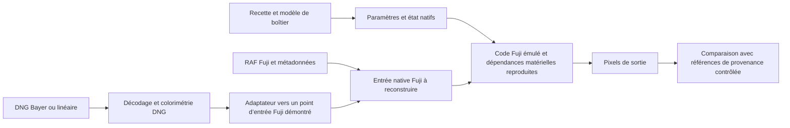

# Étude : X RAW Studio autonome, moteur Fuji exact, RAF et DNG

Date de recherche : 11 septembre 2026.

## Objectif et conclusion actuelle

Le produit visé est une application locale avec navigation dans les photos, modification des recettes, aperçu et export, sans appareil connecté. Son moteur doit exécuter le traitement Fuji authentique. Une approximation visuelle ne satisfait pas cet objectif.

La faisabilité complète **n’est pas démontrée**. Le projet dispose maintenant d’un extracteur X-T4 2.12 et exécute le constructeur natif de paramètres RAW sur Mac. Il n’exécute pas encore le calcul des pixels. Les aperçus RAW de diagnostic ne constituent pas une émulation du traitement Fuji. [Détail des premières exécutions natives](NATIVE_XT4.md).

## Ce que les sources établissent

1. **X RAW Studio utilise le boîtier pour développer les RAW.** La documentation officielle attribue la conversion au processeur de la caméra reliée en USB. Une interface compatible avec le protocole ne remplace donc pas automatiquement le calcul d’image. [Fujifilm, X RAW Studio](https://www.fujifilm-x.com/global/products/software/x-raw-studio/).

2. **Le travail Reddit concerne surtout la compatibilité et la sélection des simulations.** Dans l’ajout « Deep Dive », l’auteur rapporte des essais sur certaines fonctions ARM réelles avec des données et états mémoire contrôlés. Il précise que la chaîne complète capteur→JPEG n’est pas émulée et que certaines opérations matérielles sont remplacées. Les 1 248 cas annoncés concernent un périmètre de compatibilité, pas 1 248 RAW reproduits pixel par pixel. Il annonce un dépôt à venir ; ce travail n’a pas été reproduit ici. [Publication et discussion](https://www.reddit.com/r/fujifilm/comments/1wda2x6/xt3_running_classic_negative_eterna_bleach_bypass/).

3. **FujiHack documente surtout l’environnement système.** La page RTOS s’appuie sur le X-A2. Elle traite de la couche de compatibilité, de la mémoire et des tâches, et mentionne des traitements JPEG/MOV matériels. Elle ne suffit pas à établir la répartition de tous les calculs couleur sur X-T4 ou X100VI. [FujiHack, RTOS](https://wiki.fujihack.org/rtos/).

4. **Les deux générations doivent être étudiées séparément.** La table communautaire indique Cortex-A7/ThreadX pour X-T3 et X-T4, Cortex-A53/ThreadX 64/Linux pour X100VI. Le format de mise à jour indiqué passe de X6 à X8. Ce sont des informations de rétro-ingénierie à confirmer pour chaque image binaire. [fffw, CPU et OS](https://github.com/tiredboffin/fffw/wiki/CPU-and-OS-History-Table).

5. **fffw offre des repères, avec des composants manquants.** Le README principal décrit `ffem` pour l’exécution de fonctions ciblées et limite la conversion ELF aux parties ARM, excluant notamment les DSP. Le dossier `ffun` contient maintenant certains fichiers publics, mais sa publication reste partielle. Au commit `bedc091e0b54a1a34aaf6929dd08e1db36d13b08`, le wrapper `ffcompress` importe `ffun/internal/fflz`, absent de l’arbre récupéré. Il ne peut pas fournir à lui seul le décompresseur. [README principal](https://github.com/tiredboffin/fffw), [ffun](https://github.com/tiredboffin/fffw/tree/main/ffun), [wrapper étudié](https://github.com/tiredboffin/fffw/blob/bedc091e0b54a1a34aaf6929dd08e1db36d13b08/ffun/internal/cli/ffcompress/run.go).

6. **rawji et fxraw peuvent aider pour le protocole et les recettes**, mais leurs conversions passent par une caméra. Ils ne résolvent pas le calcul autonome. [rawji](https://github.com/pinpox/rawji), [fxraw](https://github.com/tkcranny/fxraw).

## Constatations locales reproductibles

### Firmware X-T4 2.12

Fichier de travail : `research/firmware/XT4-2.12.DAT`, provenant du [téléchargement officiel](https://www.fujifilm-x.com/global/support/download/firmware/cameras/x-t4/). Taille : 51 278 280 octets. SHA-256 :

```text
853d273b5603d3a2b93493f0ebd6a762b0b4b6bdc70317777775ae5f8ed93bc5
```

L’inspecteur retrouve le mot de format `6` et les mots de version `0x2`, `0x12`. Dans une vue XOR 0xFF utilisée uniquement pour repérage, il trouve notamment :

| Offset dans le DAT | Indice |
|---|---|
| `0x7b250` | chaîne d’identification ThreadX SMP/Cortex-A7 |
| `0x473ffa` | `BLEACH_BYP` |
| `0x4750cb` | `CLASSICNEGA` |
| `0x4d1133` | `RawConvert` |
| `0x4d1601` | `FilmSimul` |

Ces offsets de reconnaissance initiale ne sont **pas** des adresses de fonctions. Des caractères lisibles peuvent apparaître dans des flux compressés. Le parseur public de [FujiHack](https://github.com/fujihack/patcher) fournit un repère pour la version, mais ses hypothèses d’en-tête ne décrivent pas intégralement ce DAT. Le travail local ultérieur a validé les sept segments, reconstitué un décodeur pour les quatre objets compressés repérés et corroboré deux bases mémoire. Aucune extraction de LUT couleur ni équivalence complète à un dump RAM n’est revendiquée. [Format, preuves et limites](NATIVE_XT4.md).

Le fichier public `mode_fsim.h` de fffw pour X-T4 2.12 fournit aussi des valeurs internes nommées ETERNA, SUPERIA et BLEACH_BYPASS. Leur équivalence avec les numéros de menus ou les codes USB ne doit pas être supposée. [Définition versionnée](https://github.com/tiredboffin/fffw/blob/bedc091e0b54a1a34aaf6929dd08e1db36d13b08/ffun/ports/xt4/0212/mode_fsim.h).

### X RAW Studio installé

Inspection statique en lecture seule de `/Applications/FUJIFILM X RAW STUDIO.app/Contents/Frameworks/XRFC.dylib` avec `file`, `nm -gU` et `strings`. La bibliothèque contient des architectures x86_64 et arm64. Les exports/chaînes incluent `XRFC_ConvertImage`, `XRFC_OpenUSB`, `XSDK_ConvertRAWImage` et des erreurs relatives à une connexion USB absente.

Cela constitue un repère pour tracer l’interface et les paramètres. Cette inspection n’établit ni la présence ni l’absence absolue d’un moteur logiciel caché ; l’interprétation comme couche de contrôle est cohérente avec la documentation officielle. Aucune modification de l’application installée.

## Architecture à construire



L’interface utilisateur pourra appeler un moteur local via un processus isolé. Avant cela, il faut choisir un point d’entrée effectivement utilisable : avant dématriçage, après dématriçage ou avant conversion couleur. Cette décision dépendra des fonctions retrouvées. Elle ne doit pas être imposée par le tableau linéaire sRGB du diagnostic actuel.

### Cas DNG

Les fichiers testés illustrent deux entrées différentes : un DNG Leica Q3 43 contient une mosaïque Bayer 2×2 ; le DNG Apple ProRAW testé est déjà une image linéaire multicanal sans CFA exposé par LibRaw. Le RAF X100VI utilise une mosaïque X-Trans 6×6.

Changer l’extension ou la marque EXIF ne transforme pas les pixels. L’adaptateur devra considérer les niveaux noir/blanc, les matrices et illuminants, le dématriçage éventuel, la balance des blancs, les transformations de gamut et les arrondis. La spécification DNG est le point de référence. [Adobe, DNG et spécification](https://helpx.adobe.com/camera-raw/desktop/dng-and-file-formats/digital-negative.html).

Deux exigences restent distinctes :

- **RAF du modèle cible :** égalité avec la conversion Fuji à recette, version, géométrie et état identiques.
- **DNG d’un autre appareil :** utilisation des véritables étapes Fuji après une adaptation définie et testée. Cela ne garantit pas la même capture qu’un capteur Fuji, dont la réponse spectrale et le bruit sont différents.

Les aperçus LibRaw actuels sont réduits et limités à sRGB ; ils ne sont pas un format intermédiaire suffisamment défini pour revendiquer une adaptation exacte.

## Jalons et critères d’acceptation

| Jalon | Travail | Preuve attendue |
|---|---|---|
| 0 — réalisé | Inventaire, entrées test, analyse statique, banc ARM et comparateur | Rapports locaux et tests |
| 1 — partiellement réalisé | Sept segments vérifiés, quatre objets décompressés, deux bases corroborées | Manifestes et quatre sorties de taille exacte ; autres cartographies et comparaison RAM restent ouvertes |
| 2 — en cours | Constructeur natif de paramètres exécuté ; premier calcul d’image à retrouver | 136 cas admissibles, 10 erreurs explicites ; conventions et entrées synthétiques documentées |
| 3 | Identifier chaque accès ROM, calibration, coprocesseur, DMA ou registre ISP | Carte des dépendances ; aucun périphérique inconnu silencieusement remplacé |
| 4 | Faire convertir un RAW par une chaîne locale complète | Pixels reproductibles, comparaison à une référence Fuji contrôlée |
| 5 | Porter les conclusions au X100VI et construire l’entrée DNG | Tests séparés pour RAF X100VI, Bayer DNG et DNG linéaire |
| 6 | Construire l’application type X RAW Studio | Édition de recette, aperçu fiable, sauvegarde et export sans connexion caméra |

Les premiers tests exacts doivent désactiver le grain et les paramètres aléatoires, puis ajouter les effets un à un. Comparer d’abord les pixels avant encodage si ce point est accessible, puis les sorties avec le même encodeur. Une égalité binaire de JPEG n’est pas interchangeable avec une égalité des pixels décodés.

Les JPEG embarqués disponibles permettent un contrôle partiel de l’apparence, mais pas la validation de toutes les recettes. Des références issues du même modèle et de réglages connus seront nécessaires pour certifier l’équivalence. Elles peuvent avoir été produites auparavant : l’usage final de l’application reste sans boîtier.

Le principal risque technique est qu’une partie essentielle du rendu soit exécutée par des blocs non disponibles sous forme de code ARM réutilisable. Dans ce cas, ces blocs devront être compris et reproduits exactement ; émuler ThreadX ne suffira pas. Aucun délai ferme ni garantie de succès ne peut être établi avant les jalons 1 à 3.

## Prochaine action concrète

Le chemin `0x02237770 → 0x022388b8 → 0x022357ac` termine avec un calendrier explicite. Les constructeurs de synchronisation et les initialisations de requêtes natifs amènent l’orchestrateur jusqu’au lecteur `0x01171388`. Ce dernier lit la géométrie des métadonnées d’un RAF X100VI réel. Relier maintenant ce bloc au descripteur complet et aux buffers de `0x022365a8`, puis déterminer le premier calcul de pixels et ses dépendances. [Nouveaux résultats et limites](NATIVE_RUNTIME.md).
